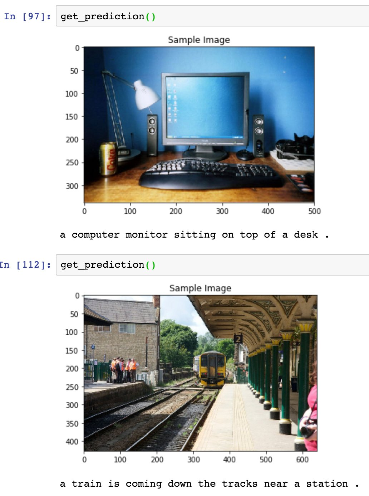

# photo_captioning
Demonstration of photo captioning using neural nets (encoder/decoder similar to <a href="https://arxiv.org/abs/1411.4555">Show and Tell</a>).

Captions MS-COCO images pretty well (what the model was trained on) but leaves something to be desired with random snapshots:

